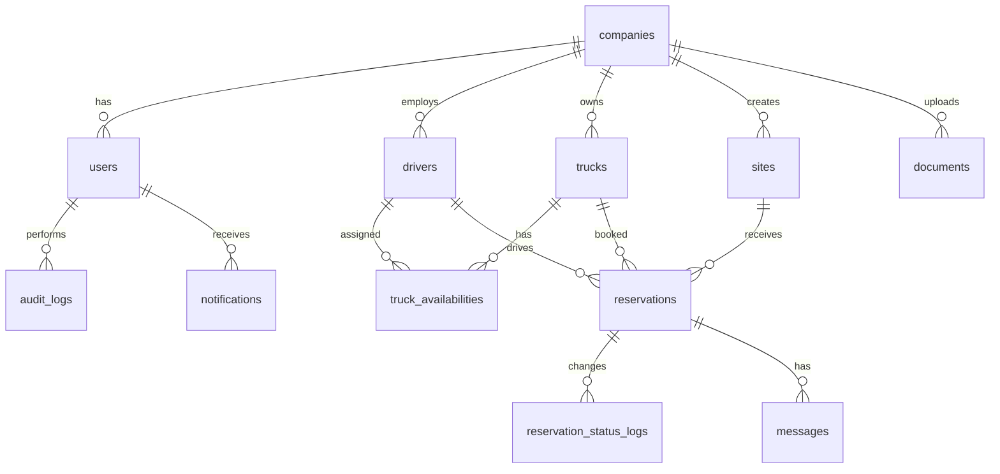

# ダンプ・現場マッチングアプリ DB設計書 MVP版

作成日: 2026-06-24  
想定DB: PostgreSQL / Supabase  
対象範囲: MVP本番版

## 1. 設計方針

このDB設計は、最初の本番版で必要な「会社審査」「現場登録」「ダンプ登録」「空き予定」「予約申請・承認」「残台数計算」「通知」「操作履歴」を中心にしています。

MVPでは、GPS常時追跡、アプリ内決済、自動請求、評価機能は後回しにします。ただし、後から追加しやすいように、予約・会社・車両・実績の関係は分けておきます。

## 2. 主要エンティティ



## 3. ステータス定義

DBでは文字列Enum、またはPostgreSQLのEnum型で管理します。初期開発では文字列 + CHECK制約でも十分です。

### 3.1 company_status

| 値 | 意味 |
|---|---|
| pending | 審査待ち |
| approved | 承認済み |
| rejected | 差戻し |
| suspended | 停止 |

### 3.2 company_type

| 値 | 意味 |
|---|---|
| site_company | 現場会社 |
| truck_company | ダンプ会社 |
| both | 両方 |
| operator | 運営会社 |

### 3.3 user_role

| 値 | 意味 |
|---|---|
| system_admin | システム管理者 |
| operator | 運営管理者 |
| company_admin | 会社管理者 |
| dispatcher | 配車担当 |
| driver | ドライバー |
| viewer | 閲覧のみ |

### 3.4 site_status

| 値 | 意味 |
|---|---|
| draft | 下書き |
| open | 募集中 |
| paused | 一時停止 |
| filled | 充足 |
| completed | 完了 |
| canceled | キャンセル |

### 3.5 truck_status

| 値 | 意味 |
|---|---|
| available | 空き |
| held | 仮押さえ |
| booked | 予約済み |
| unavailable | 停止 |

### 3.6 reservation_status

| 値 | 意味 | 残台数への影響 |
|---|---|---:|
| requested | 申請中 | なし |
| approved | 承認済み | 減算 |
| booked | 予約済み | 減算 |
| in_progress | 稼働中 | 減算 |
| completed | 完了 | 実績対象 |
| canceled | キャンセル | なし |
| rejected | 却下 | なし |

## 4. テーブル定義

### 4.1 companies

会社情報。現場会社、ダンプ会社、運営会社を同じテーブルで管理します。

| カラム | 型 | 必須 | 説明 |
|---|---|---:|---|
| id | uuid | 必須 | 主キー |
| company_code | text | 必須 | 表示用コード。例: C-0001 |
| company_type | text | 必須 | site_company / truck_company / both / operator |
| name | text | 必須 | 会社名 |
| corporate_number | text | 任意 | 法人番号 |
| representative_name | text | 任意 | 代表者名 |
| postal_code | text | 任意 | 郵便番号 |
| address | text | 必須 | 住所 |
| phone | text | 必須 | 代表電話 |
| email | text | 必須 | 代表メール |
| status | text | 必須 | pending / approved / rejected / suspended |
| review_note | text | 任意 | 審査メモ |
| created_at | timestamptz | 必須 | 作成日時 |
| updated_at | timestamptz | 必須 | 更新日時 |

推奨制約:

- company_code は UNIQUE
- email は UNIQUE推奨
- status が approved 以外の会社は予約確定不可

### 4.2 users

ログインユーザー。

| カラム | 型 | 必須 | 説明 |
|---|---|---:|---|
| id | uuid | 必須 | 主キー。認証サービスのユーザーIDと一致させる |
| company_id | uuid | 必須 | companies.id |
| name | text | 必須 | 氏名 |
| email | text | 必須 | ログインメール |
| phone | text | 任意 | 電話番号 |
| role | text | 必須 | user_role |
| is_active | boolean | 必須 | 有効/停止 |
| last_login_at | timestamptz | 任意 | 最終ログイン |
| created_at | timestamptz | 必須 | 作成日時 |
| updated_at | timestamptz | 必須 | 更新日時 |

推奨制約:

- email は UNIQUE
- company_id にインデックス
- role によって画面・操作権限を制御

### 4.3 drivers

ドライバー情報。個人情報なので表示範囲を絞ります。

| カラム | 型 | 必須 | 説明 |
|---|---|---:|---|
| id | uuid | 必須 | 主キー |
| company_id | uuid | 必須 | 所属ダンプ会社 |
| driver_code | text | 必須 | 表示用コード。例: DR-0001 |
| name | text | 必須 | 氏名 |
| phone | text | 任意 | 緊急連絡用 |
| license_type | text | 必須 | 大型 / 中型 / 準中型など |
| skills | text[] | 必須 | 大型、深ダンプ、夜間など |
| license_expires_on | date | 任意 | 免許期限 |
| status | text | 必須 | active / inactive / suspended |
| created_at | timestamptz | 必須 | 作成日時 |
| updated_at | timestamptz | 必須 | 更新日時 |

推奨制約:

- driver_code は UNIQUE
- license_expires_on が過去なら予約時に警告

### 4.4 trucks

車両・ダンプ情報。

| カラム | 型 | 必須 | 説明 |
|---|---|---:|---|
| id | uuid | 必須 | 主キー |
| company_id | uuid | 必須 | 所属ダンプ会社 |
| truck_code | text | 必須 | 表示用コード。例: D-0201 |
| plate_number | text | 必須 | 車両番号 |
| truck_type | text | 必須 | 大型ダンプ / 小型ダンプ / 深ダンプ |
| load_capacity | numeric | 任意 | 積載量 |
| skills | text[] | 必須 | 対応スキル |
| base_address | text | 任意 | 待機場所 |
| base_lat | numeric | 任意 | 待機場所の緯度 |
| base_lng | numeric | 任意 | 待機場所の経度 |
| desired_daily_price | integer | 任意 | 希望日額 |
| vehicle_inspection_expires_on | date | 任意 | 車検期限 |
| insurance_expires_on | date | 任意 | 保険期限 |
| status | text | 必須 | available / held / booked / unavailable |
| created_at | timestamptz | 必須 | 作成日時 |
| updated_at | timestamptz | 必須 | 更新日時 |

推奨制約:

- truck_code は UNIQUE
- plate_number は UNIQUE
- status が unavailable の車両はマッチ候補に出さない

### 4.5 sites

現場・配車依頼。

| カラム | 型 | 必須 | 説明 |
|---|---|---:|---|
| id | uuid | 必須 | 主キー |
| company_id | uuid | 必須 | 現場会社 |
| site_code | text | 必須 | 表示用コード。例: S-0101 |
| name | text | 必須 | 現場名 |
| address | text | 必須 | 現場住所 |
| lat | numeric | 任意 | 緯度 |
| lng | numeric | 任意 | 経度 |
| start_date | date | 必須 | 使用開始日 |
| end_date | date | 必須 | 使用終了日 |
| required_truck_count | integer | 必須 | 必要台数 |
| required_skills | text[] | 必須 | 必要スキル |
| daily_price | integer | 必須 | 日額 |
| payment_terms | text | 任意 | 支払条件 |
| notes | text | 任意 | 注意事項 |
| status | text | 必須 | draft / open / paused / filled / completed / canceled |
| created_by | uuid | 必須 | users.id |
| created_at | timestamptz | 必須 | 作成日時 |
| updated_at | timestamptz | 必須 | 更新日時 |

推奨制約:

- site_code は UNIQUE
- end_date >= start_date
- required_truck_count >= 1
- daily_price >= 0

### 4.6 truck_availabilities

車両の空き予定。日単位のMVPから始めます。

| カラム | 型 | 必須 | 説明 |
|---|---|---:|---|
| id | uuid | 必須 | 主キー |
| truck_id | uuid | 必須 | trucks.id |
| driver_id | uuid | 任意 | drivers.id |
| available_start_date | date | 必須 | 空き開始日 |
| available_end_date | date | 必須 | 空き終了日 |
| area_note | text | 任意 | 対応エリア |
| desired_daily_price | integer | 任意 | この空き予定での希望日額 |
| is_active | boolean | 必須 | 有効/無効 |
| created_at | timestamptz | 必須 | 作成日時 |
| updated_at | timestamptz | 必須 | 更新日時 |

推奨制約:

- available_end_date >= available_start_date
- is_active = false の予定はマッチ候補から除外

### 4.7 reservations

予約本体。残台数計算の中心になります。

| カラム | 型 | 必須 | 説明 |
|---|---|---:|---|
| id | uuid | 必須 | 主キー |
| reservation_code | text | 必須 | 表示用コード。例: R-0001 |
| site_id | uuid | 必須 | sites.id |
| truck_id | uuid | 必須 | trucks.id |
| driver_id | uuid | 任意 | drivers.id |
| applicant_company_id | uuid | 必須 | 申請したダンプ会社 |
| approved_by | uuid | 任意 | 承認者 users.id |
| start_date | date | 必須 | 予約開始日 |
| end_date | date | 必須 | 予約終了日 |
| fixed_daily_price | integer | 必須 | 予約時に確定した日額 |
| status | text | 必須 | reservation_status |
| cancel_reason | text | 任意 | キャンセル理由 |
| note | text | 任意 | 備考 |
| requested_at | timestamptz | 必須 | 申請日時 |
| approved_at | timestamptz | 任意 | 承認日時 |
| canceled_at | timestamptz | 任意 | キャンセル日時 |
| created_at | timestamptz | 必須 | 作成日時 |
| updated_at | timestamptz | 必須 | 更新日時 |

推奨制約:

- reservation_code は UNIQUE
- end_date >= start_date
- fixed_daily_price >= 0
- 同じ truck_id で、日程が重なる active 予約を禁止
- active 予約とは approved / booked / in_progress

PostgreSQLで重複予約を強く防ぐ場合は、date range + exclusion constraint を検討します。

### 4.8 reservation_status_logs

予約ステータス変更履歴。

| カラム | 型 | 必須 | 説明 |
|---|---|---:|---|
| id | uuid | 必須 | 主キー |
| reservation_id | uuid | 必須 | reservations.id |
| from_status | text | 任意 | 変更前 |
| to_status | text | 必須 | 変更後 |
| changed_by | uuid | 必須 | users.id |
| reason | text | 任意 | 理由 |
| created_at | timestamptz | 必須 | 作成日時 |

### 4.9 documents

会社、車両、ドライバー、予約などに紐づく書類。

| カラム | 型 | 必須 | 説明 |
|---|---|---:|---|
| id | uuid | 必須 | 主キー |
| company_id | uuid | 必須 | アップロード会社 |
| target_type | text | 必須 | company / truck / driver / reservation / site |
| target_id | uuid | 必須 | 対象ID |
| document_type | text | 必須 | license / insurance / inspection / photo / receipt など |
| file_url | text | 必須 | 保存先URL |
| original_filename | text | 必須 | 元ファイル名 |
| expires_on | date | 任意 | 有効期限 |
| uploaded_by | uuid | 必須 | users.id |
| created_at | timestamptz | 必須 | 作成日時 |

### 4.10 notifications

アプリ内通知。

| カラム | 型 | 必須 | 説明 |
|---|---|---:|---|
| id | uuid | 必須 | 主キー |
| user_id | uuid | 必須 | 宛先 |
| notification_type | text | 必須 | reservation_requested など |
| title | text | 必須 | 件名 |
| body | text | 必須 | 本文 |
| related_type | text | 任意 | reservation / site / truck |
| related_id | uuid | 任意 | 関連ID |
| read_at | timestamptz | 任意 | 既読日時 |
| created_at | timestamptz | 必須 | 作成日時 |

### 4.11 messages

予約に紐づくチャット。MVPでは任意ですが、将来を考えて設計しておきます。

| カラム | 型 | 必須 | 説明 |
|---|---|---:|---|
| id | uuid | 必須 | 主キー |
| reservation_id | uuid | 必須 | reservations.id |
| sender_id | uuid | 必須 | users.id |
| body | text | 必須 | 本文 |
| created_at | timestamptz | 必須 | 送信日時 |

### 4.12 audit_logs

重要操作の監査ログ。

| カラム | 型 | 必須 | 説明 |
|---|---|---:|---|
| id | uuid | 必須 | 主キー |
| actor_user_id | uuid | 必須 | 操作ユーザー |
| action | text | 必須 | create_site / approve_reservation など |
| target_type | text | 必須 | site / truck / reservation など |
| target_id | uuid | 必須 | 対象ID |
| before_data | jsonb | 任意 | 変更前 |
| after_data | jsonb | 任意 | 変更後 |
| ip_address | text | 任意 | IP |
| user_agent | text | 任意 | 端末情報 |
| created_at | timestamptz | 必須 | 作成日時 |

## 5. 計算ビュー

### 5.1 site_reservation_summary

現場一覧で毎回使うため、ビューまたはAPI側集計にします。

| 項目 | 計算 |
|---|---|
| site_id | sites.id |
| required_truck_count | sites.required_truck_count |
| booked_count | reservations のうち approved / booked / in_progress の件数 |
| remaining_count | required_truck_count - booked_count |
| is_filled | remaining_count <= 0 |

SQLイメージ:

```sql
create view site_reservation_summary as
select
  s.id as site_id,
  s.required_truck_count,
  count(r.id) filter (
    where r.status in ('approved', 'booked', 'in_progress')
  ) as booked_count,
  s.required_truck_count - count(r.id) filter (
    where r.status in ('approved', 'booked', 'in_progress')
  ) as remaining_count
from sites s
left join reservations r on r.site_id = s.id
group by s.id, s.required_truck_count;
```

## 6. 推奨インデックス

| テーブル | インデックス | 目的 |
|---|---|---|
| companies | status | 審査一覧 |
| users | company_id | 会社別ユーザー取得 |
| trucks | company_id, status | 会社別・空き車両取得 |
| trucks | skills | スキル検索 |
| sites | company_id, status | 会社別・募集中現場取得 |
| sites | start_date, end_date | 日程検索 |
| sites | required_skills | スキル検索 |
| truck_availabilities | truck_id | 車両別予定 |
| truck_availabilities | available_start_date, available_end_date | 日程検索 |
| reservations | site_id | 現場別予約 |
| reservations | truck_id, start_date, end_date | 重複予約確認 |
| reservations | status | 承認待ち・予約済み一覧 |
| notifications | user_id, read_at | 未読通知 |
| audit_logs | target_type, target_id | 対象別履歴 |

## 7. 予約作成時のトランザクション

予約確定時は、同時に複数人が予約しても残台数が狂わないように、トランザクション内で処理します。

1. 現場をロックする
2. 現在の予約台数を再計算する
3. 残り台数が1以上か確認する
4. 車両に重複予約がないか確認する
5. 車両・会社・ドライバーが有効か確認する
6. reservations を作成または更新する
7. trucks.status を booked に変更する
8. reservation_status_logs を作成する
9. notifications を作成する
10. audit_logs を作成する

## 8. Row Level Security方針

Supabaseを使う場合はRLSを有効にします。

| データ | 管理者 | 現場会社 | ダンプ会社 |
|---|---|---|---|
| companies | 全件 | 自社のみ | 自社のみ |
| users | 全件 | 自社のみ | 自社のみ |
| sites | 全件 | 自社作成分 + 募集中 | 募集中のみ |
| trucks | 全件 | 予約に関係する範囲 | 自社分 |
| reservations | 全件 | 自社現場分 | 自社車両分 |
| documents | 全件 | 自社分 | 自社分 |
| audit_logs | 全件 | 自社関連のみ | 自社関連のみ |

## 9. MVPで最初に作るAPI

| API | 用途 |
|---|---|
| POST /companies | 会社登録 |
| PATCH /companies/:id/approve | 会社承認 |
| GET /sites | 現場一覧 |
| POST /sites | 現場登録 |
| PATCH /sites/:id | 現場編集 |
| GET /trucks | ダンプ一覧 |
| POST /trucks | ダンプ登録 |
| POST /truck-availabilities | 空き予定登録 |
| GET /matches | マッチ候補取得 |
| POST /reservations/request | 予約申請 |
| PATCH /reservations/:id/approve | 予約承認 |
| PATCH /reservations/:id/cancel | 予約キャンセル |
| GET /notifications | 通知一覧 |
| PATCH /notifications/:id/read | 既読 |

## 10. 最初に作るシードデータ

検証用に、最低限以下を用意します。

| データ | 件数 |
|---|---:|
| 運営会社 | 1 |
| 現場会社 | 2 |
| ダンプ会社 | 3 |
| 管理者ユーザー | 1 |
| 現場会社ユーザー | 2 |
| ダンプ会社ユーザー | 3 |
| ドライバー | 5 |
| 車両 | 5 |
| 現場 | 5 |
| 空き予定 | 8 |
| 予約 | 5 |

## 11. 注意点

- ドライバー電話番号、免許情報、位置情報は個人情報として扱う。
- 予約確定後の単価は、現場の金額変更に連動させず、reservations.fixed_daily_price に固定する。
- 残台数は保存せず、予約状態から計算する。表示高速化が必要になったら集計テーブルを検討する。
- 「紹介だけ」か「受発注まで担う」かで、契約・請求・責任範囲が大きく変わる。
- GPS常時追跡を入れる場合は、同意、保存期間、表示範囲、削除手順を別途設計する。
