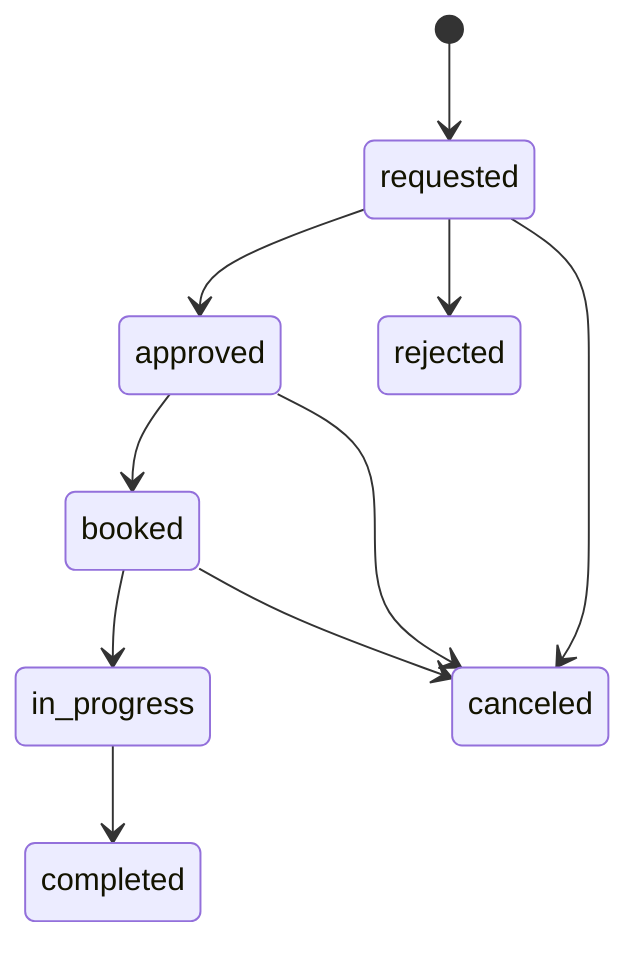

# ダンプ・現場マッチングアプリ 要件定義書 MVP版

作成日: 2026-06-24  
目的: 開発見積もり・初期本番開発のたたき台

## 1. 概要

本システムは、建設・解体・土木などの現場会社が必要なダンプ台数を登録し、ダンプ会社が空き車両を登録・応募できるマッチングアプリです。

MVPでは、まず「現場登録」「ダンプ登録」「空き予定」「マッチ候補」「予約申請」「予約承認」「残台数管理」を本番運用できる形にします。請求・支払・GPS常時追跡・チャット・写真管理は次フェーズで追加します。

## 2. ゴール

### 2.1 業務ゴール

- 現場が必要台数を登録できる
- ダンプ会社が空き車両を登録できる
- 条件に合う現場・車両を素早く探せる
- 予約申請から承認までをアプリ上で管理できる
- 現場ごとの予約台数・残り台数が自動で分かる
- 管理者が会社、車両、予約状況を確認できる

### 2.2 MVP成功条件

| 指標 | 目標 |
|---|---|
| 現場登録 | 管理者・現場会社が登録できる |
| ダンプ登録 | 管理者・ダンプ会社が登録できる |
| マッチング | 日程・スキル・金額・距離をもとに候補表示できる |
| 予約 | 申請、承認、キャンセルができる |
| 残台数 | 予約承認後に自動で減る |
| 権限 | 会社ごとに見える情報が分かれる |
| 履歴 | 予約変更の履歴が残る |

## 3. 対象ユーザー

| ユーザー | 目的 |
|---|---|
| 運営管理者 | 会社審査、予約管理、トラブル対応 |
| 現場会社管理者 | 現場登録、予約状況確認 |
| 現場担当者 | 自社現場の登録・確認 |
| ダンプ会社管理者 | 車両・ドライバー登録、予約申請 |
| 配車担当 | 空き予定登録、応募、予約確認 |
| ドライバー | 将来、担当予約・ナビ・入退場確認 |

MVPではドライバー専用画面は簡易版、または後回しでも可とします。

## 4. MVP機能範囲

### 4.1 認証・権限

| 要件ID | 要件 | 優先度 |
|---|---|---|
| AUTH-01 | メールアドレスとパスワードでログインできる | 必須 |
| AUTH-02 | 管理者、現場会社、ダンプ会社で権限を分ける | 必須 |
| AUTH-03 | 会社に所属するユーザーだけが自社データを見られる | 必須 |
| AUTH-04 | パスワード再設定ができる | 必須 |
| AUTH-05 | ユーザー停止ができる | 必須 |

### 4.2 会社管理

| 要件ID | 要件 | 優先度 |
|---|---|---|
| COM-01 | 会社登録ができる | 必須 |
| COM-02 | 会社種別を設定できる | 必須 |
| COM-03 | 管理者が会社を承認・差戻し・停止できる | 必須 |
| COM-04 | 承認前の会社は予約確定できない | 必須 |
| COM-05 | 会社ごとにユーザーを追加できる | 推奨 |

### 4.3 現場管理

| 要件ID | 要件 | 優先度 |
|---|---|---|
| SITE-01 | 現場を新規登録できる | 必須 |
| SITE-02 | 現場名、住所、期間、必要台数、金額、必要スキルを登録できる | 必須 |
| SITE-03 | 現場一覧を検索・絞り込みできる | 必須 |
| SITE-04 | 現場詳細を表示できる | 必須 |
| SITE-05 | 現場を編集できる | 必須 |
| SITE-06 | 現場状態を下書き、募集中、一時停止、充足、完了、キャンセルで管理できる | 必須 |
| SITE-07 | 予約台数と残り台数を自動表示できる | 必須 |
| SITE-08 | Google Mapsで住所を開ける | 必須 |

### 4.4 ダンプ・車両管理

| 要件ID | 要件 | 優先度 |
|---|---|---|
| TRUCK-01 | ダンプ会社が車両を登録できる | 必須 |
| TRUCK-02 | 車両番号、車種、対応スキル、希望単価を登録できる | 必須 |
| TRUCK-03 | ドライバーを登録できる | 必須 |
| TRUCK-04 | 車両・ドライバーを有効/停止にできる | 必須 |
| TRUCK-05 | 車検・保険・免許期限を登録できる | 推奨 |
| TRUCK-06 | 書類をアップロードできる | 推奨 |

### 4.5 空き予定

| 要件ID | 要件 | 優先度 |
|---|---|---|
| AVAIL-01 | 車両ごとに空き開始日・終了日を登録できる | 必須 |
| AVAIL-02 | 対応エリアや希望単価を登録できる | 推奨 |
| AVAIL-03 | 無効化した空き予定は候補に出ない | 必須 |
| AVAIL-04 | 予約済み期間と重なる空き予定は警告する | 必須 |

### 4.6 マッチング

| 要件ID | 要件 | 優先度 |
|---|---|---|
| MATCH-01 | 現場と空き車両を日程で照合する | 必須 |
| MATCH-02 | 必要スキルと車両スキルを照合する | 必須 |
| MATCH-03 | 希望単価と現場金額の差を表示する | 必須 |
| MATCH-04 | 待機場所と現場住所の距離を表示する | 推奨 |
| MATCH-05 | おすすめ順に並べる | 推奨 |
| MATCH-06 | 期限切れ書類がある車両は警告する | 推奨 |

### 4.7 予約

| 要件ID | 要件 | 優先度 |
|---|---|---|
| RSV-01 | ダンプ会社が現場へ予約申請できる | 必須 |
| RSV-02 | 管理者が予約申請を承認・却下できる | 必須 |
| RSV-03 | 承認後、予約済みになる | 必須 |
| RSV-04 | 予約済みになると現場の残り台数が減る | 必須 |
| RSV-05 | 同じ車両の同日重複予約を禁止する | 必須 |
| RSV-06 | 残台数が0の現場には新規予約できない | 必須 |
| RSV-07 | 予約キャンセルができる | 必須 |
| RSV-08 | キャンセル理由を記録できる | 必須 |
| RSV-09 | 予約状態の変更履歴を残す | 必須 |

### 4.8 通知

| 要件ID | 要件 | 優先度 |
|---|---|---|
| NOTI-01 | 予約申請時に管理者へ通知する | 必須 |
| NOTI-02 | 予約承認・却下時にダンプ会社へ通知する | 必須 |
| NOTI-03 | キャンセル時に関係者へ通知する | 必須 |
| NOTI-04 | アプリ内通知一覧を表示する | 必須 |
| NOTI-05 | メール通知を送る | 推奨 |
| NOTI-06 | LINE通知を送る | Phase 2 |

### 4.9 管理・監査

| 要件ID | 要件 | 優先度 |
|---|---|---|
| ADMIN-01 | 管理者ダッシュボードを表示する | 必須 |
| ADMIN-02 | 募集中現場、空き車両、予約済み、不足台数を表示する | 必須 |
| ADMIN-03 | 予約一覧を状態別に確認できる | 必須 |
| ADMIN-04 | 会社一覧と審査状態を確認できる | 必須 |
| ADMIN-05 | 重要操作の履歴を確認できる | 必須 |

## 5. 画面要件

| 画面 | MVP | 備考 |
|---|---:|---|
| ログイン | 必須 | パスワード再設定含む |
| 初回会社登録 | 必須 | 会社種別選択 |
| 管理者ダッシュボード | 必須 | KPI表示 |
| 会社審査 | 必須 | 承認、差戻し、停止 |
| 現場一覧 | 必須 | 検索、フィルタ |
| 現場詳細 | 必須 | 予約状況、ナビ |
| 現場登録・編集 | 必須 | 必要台数、金額、スキル |
| ダンプ一覧 | 必須 | 状態、会社、スキル |
| ダンプ登録・編集 | 必須 | 車両・ドライバー |
| 空き予定登録 | 必須 | 日付範囲 |
| マッチ候補 | 必須 | おすすめ順 |
| 予約申請 | 必須 | コメント入力 |
| 予約詳細 | 必須 | 状態、履歴 |
| 通知一覧 | 必須 | 未読/既読 |
| ユーザー管理 | 推奨 | 会社管理者向け |
| 書類管理 | 推奨 | 許可・保険・免許 |

## 6. 予約ルール

### 6.1 予約可能条件

予約申請または承認時に、以下を満たす必要があります。

1. 現場会社が承認済み
2. ダンプ会社が承認済み
3. 現場状態が募集中
4. 現場の残り台数が1以上
5. 車両が有効
6. ドライバーが有効
7. 車両の空き予定が現場期間を含む
8. 同じ車両に重複予約がない
9. 現場の必要スキルと車両・ドライバーのスキルが一致する

### 6.2 残台数計算

```text
予約台数 = 状態が approved / booked / in_progress の予約数
残り台数 = 必要台数 - 予約台数
```

### 6.3 ステータス遷移



## 7. 非機能要件

| 分類 | 要件 |
|---|---|
| セキュリティ | HTTPS必須 |
| 認証 | パスワードは認証サービス側で安全に管理 |
| 権限 | 会社別にデータを分離 |
| 個人情報 | ドライバー電話番号、免許、位置情報は表示範囲を制限 |
| 監査 | 予約・会社審査・金額変更は履歴保存 |
| バックアップ | DBを日次バックアップ |
| 可用性 | MVPは営業時間内運用を想定 |
| 性能 | 現場・車両が数千件でも一覧が3秒以内に表示 |
| スマホ対応 | 現場・ダンプ会社がスマホで操作できる |
| ブラウザ | 最新Chrome、Edge、Safari |

## 8. 外部サービス

| サービス | 用途 | MVP |
|---|---|---:|
| Supabase / Firebase Auth | ログイン | 必須 |
| PostgreSQL / Supabase DB | データ保存 | 必須 |
| Google Maps Platform | 地図、住所検索、距離計算 | 推奨 |
| メール送信サービス | 通知 | 推奨 |
| LINE Messaging API | LINE通知 | Phase 2 |
| S3 / Supabase Storage | 書類・写真保存 | 推奨 |
| Stripe | 決済 | Phase 3 |

## 9. 開発フェーズ案

### Phase 0: 要件確定

| 内容 | 期間目安 |
|---|---:|
| 業務フロー確定 | 1週間 |
| 画面一覧確定 | 1週間 |
| 契約・法務確認 | 1から2週間 |
| DB・権限設計確定 | 1週間 |

### Phase 1: MVP開発

| 内容 | 期間目安 |
|---|---:|
| 認証・会社管理 | 1から2週間 |
| 現場管理 | 1から2週間 |
| ダンプ・空き予定管理 | 1から2週間 |
| マッチング・予約 | 2から3週間 |
| 通知・履歴 | 1週間 |
| 管理画面 | 1から2週間 |
| テスト・修正 | 1から2週間 |

合計目安: 8から12週間

### Phase 2: 運用強化

| 内容 | 期間目安 |
|---|---:|
| チャット | 1から2週間 |
| 写真・伝票添付 | 1から2週間 |
| 入退場・実績 | 2週間 |
| 請求・支払管理 | 2から4週間 |
| LINE通知 | 1週間 |

## 10. 見積もり依頼時に伝える条件

開発会社へ見積もりを依頼する場合、以下を明記します。

| 項目 | 指定内容 |
|---|---|
| 目的 | ダンプ会社と現場会社の予約マッチング |
| 対象 | Webアプリ、スマホ対応 |
| 初期範囲 | MVP機能のみ |
| 決済 | 初期は不要 |
| GPS | 初期は現在地常時追跡なし |
| 地図 | Google Maps連携は必要 |
| ログイン | 会社別・権限別ログイン |
| データ移行 | 初期は手入力 |
| 保守 | 月次保守も別途見積もり |
| 納品 | GitHub、設計書、操作マニュアル |

## 11. 受け入れ条件

| No | 条件 |
|---:|---|
| 1 | 管理者が会社を承認できる |
| 2 | 現場会社が現場を登録できる |
| 3 | ダンプ会社が車両と空き予定を登録できる |
| 4 | 条件に合うマッチ候補が表示される |
| 5 | ダンプ会社が予約申請できる |
| 6 | 管理者が予約を承認できる |
| 7 | 承認後、現場の残り台数が減る |
| 8 | 同じ車両を同日に二重予約できない |
| 9 | キャンセルすると残り台数が戻る |
| 10 | 会社ごとの権限で見えるデータが分かれる |
| 11 | 重要操作が履歴に残る |
| 12 | スマホ幅でも主要操作ができる |

## 12. 本番前チェックリスト

| チェック | 内容 |
|---|---|
| 契約 | 利用規約、プライバシーポリシー、キャンセル規定 |
| 許可確認 | ダンプ会社の許可・保険・車検等の確認方法 |
| 個人情報 | ドライバー情報、位置情報、書類の保存期間 |
| 運用 | 問い合わせ窓口、緊急時連絡、障害対応 |
| セキュリティ | 権限、ログ、バックアップ、HTTPS |
| 請求 | 初期は手動請求か、システム請求か |
| サポート | 誰が登録支援・トラブル対応をするか |

## 13. 未確定事項

見積もり前に、次の点を決める必要があります。

| No | 未確定事項 | 選択肢 |
|---:|---|---|
| 1 | アプリ運営者の立場 | 紹介のみ / 受発注管理まで行う |
| 2 | 予約承認者 | 管理者のみ / 現場会社も承認可 |
| 3 | 手数料 | 現場会社負担 / ダンプ会社負担 / 月額 |
| 4 | ドライバー電話番号の表示 | 表示する / 管理者のみ / 予約後のみ |
| 5 | GPS | なし / 当日のみ / 常時 |
| 6 | キャンセル料 | 手動 / 自動計算 |
| 7 | 支払い | 請求書運用 / アプリ内決済 |
| 8 | 書類審査 | 管理者が手動確認 / 自動期限チェックのみ |

## 14. 推奨する最初の開発方針

最初から大きく作りすぎず、以下の順番で進めるのがおすすめです。

1. 会社審査、現場、ダンプ、予約だけでMVPを作る
2. 知っている会社数社でテスト運用する
3. 現場で本当に使う項目だけ残す
4. 請求・写真・チャットを追加する
5. 一般公開や手数料モデルを整える

この順番にすると、不要な機能にお金をかけすぎず、現場に合うシステムへ育てやすくなります。
